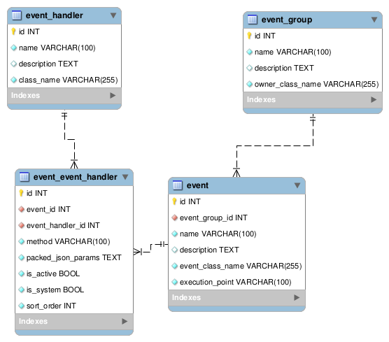

Структура
=========

Ниже представлена схема базы данных модуля yii2-events-system.

**event_group** - группы событий. Таблица содержит группы с целевыми классами на которые будут прикрепляться обработчики. По умолчанию их 4, но вы можете добавить свои собственные. Это целесообразно сделать для своих модулей. 

- `id` - идентификатор
- `name` - название группы
- `description` - описание
- `owner_class_name` - название класса к которому привязываются события группы. Может содержать дубли. Например, для логической группировки событий

**event** - события. Таблица содержит все доступные события для заданной группы. Таблица носит информативный характер и используется для построения интерфейса административной части. Поэтому каждое новое событие, которое добавили в код приложения или модуля, обязательно дублировать в эту таблицу

- `id` - идентификатор
- `event_group_id` - связь с группой
- `name` - название события
- `description` - описание
- `event_class_name` - название класса события
- `execution_point` - название точки выполнения события (уникальное имя события, которое используется в методе `trigger`)

**event_handler** - обработчики. Таблица содержит классы обработчиков. Каждый класс может в себе содержать несколько статичных методов для различныз событий

- `id` - идентификатор
- `name` - название обработчика
- `description` - описание
- `class_name` - название класса обработчика

**event_event_handler** - привазка обработчиков к событиям. Это основная таблица и именно с ней ведется работа через административный раздел

- `id` - идентификатор
- `event_id` - событие
- `event_handler_id` - обработчик
- `method` - название метода
- `packed_json_params` - параметры обработчика
- `is_active` - флаг "активен ли обработчик"
- `is_system` - флаг "системный ли это обработчик"
- `sort_order` - порядок добавления событий. Используется для последовательного выполнения обработчикой события. Например, когда необходимо остановить выполнение последующих обработчиков.

***Примечания***

Все названия классов - это полный "путь" до класса вместе с неймспейсом, но без начального слеша. Например, `yii\web\Application`.
